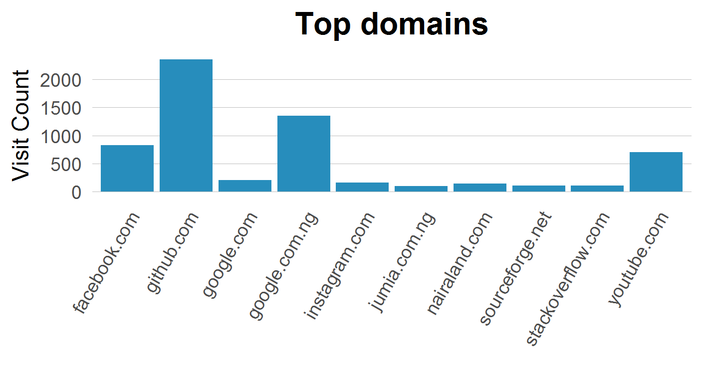
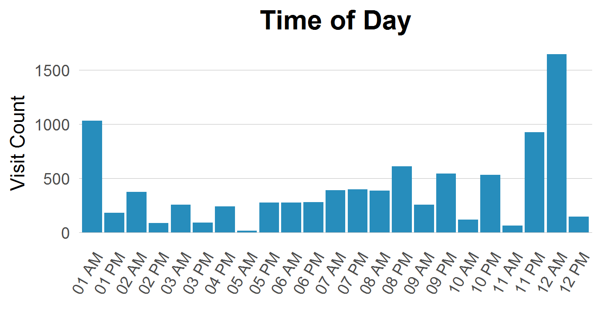
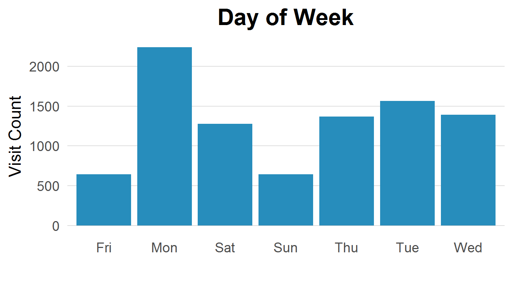

# ChromeAnalyzR

## Top Domains

|domain            | visitcount|
|:-----------------|----------:|
|github.com        |       2356|
|google.com.ng     |       1349|
|facebook.com      |        826|
|youtube.com       |        703|
|google.com        |        205|
|instagram.com     |        166|
|nairaland.com     |        150|
|stackoverflow.com |        115|
|sourceforge.net   |        109|
|jumia.com.ng      |        100|

## Top Urls 

|url                                                           | visitcount|
|:-------------------------------------------------------------|----------:|
|https://www.youtube.com/                                      |        108|
|https://twitter.com/                                          |         87|
|https://web.facebook.com/?_rdr                                |         87|
|https://web.facebook.com/                                     |         70|
|https://localhost:5000                                        |         66|
|https://www.facebook.com/                                     |         63|
|https://github.com/                                           |         49|
|http://www.facebook.com/                                      |         45|
|http://localhost:8888/                                        |         44|
|http://www.livescores.com/                                    |         41|

## Bussiest Days

|date                    | visitcount|
|:-----------------------|----------:|
|Mon, November 07, 2016  |        887|
|Tue, October 18, 2016   |        616|
|Mon, November 21, 2016  |        583|
|Mon, October 17, 2016   |        520|
|Tue, November 08, 2016  |        454|
|Sun, November 06, 2016  |        443|
|Wed, October 19, 2016   |        426|
|Wed, September 14, 2016 |        408|
|Thu, November 24, 2016  |        394|
|Thu, October 20, 2016   |        373|

## Daily stats

Daily stats             | 
----------------        | -------------
Average visits per day: | 194
Median Visits Per Day:  | 121
Today:                  | 99

## Let us C!

---

---

---
